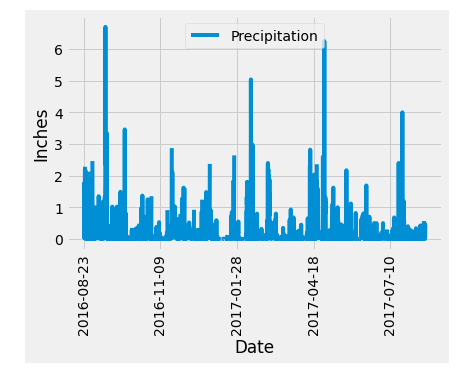
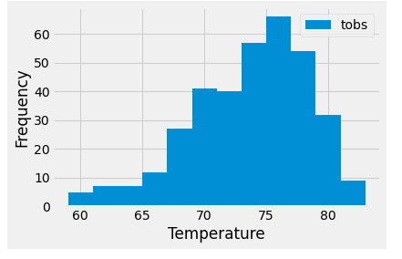

# sqlalchemy-challenge
## Module 10 Challenge
For this project I created a climate analysis for the area of Honolulu, Hawaii. First, I used Python and SQLAlchemy to do a basic climate analysis and data exploration of the Hawaii weather database. 

## Precipitation Analysis
For this analysis I retrieved the past 12 months of precipitation data and plotted the results using Pandas and Matplotlib.

## Station Analysis
In this part of the analysis I found the most-active station and designed a query that calculates the lowest, highest, and average temperatures of that station. Then, I retrieved the previous 12 months of observed temperature data at this station and plotted the results using a histogram. 

## Designing a Climate API
Now that the initial analysis has been completed, based on the queries I just developed, I created a Flask API. The routes are as follows;

- /api/v1.0/precipitation
- /api/v1.0/stations
- /api/v1.0/tobs
- /api/v1.0/temp/start/
- /api/v1.0/temps/start/end

(example photo of one of the routes working?)