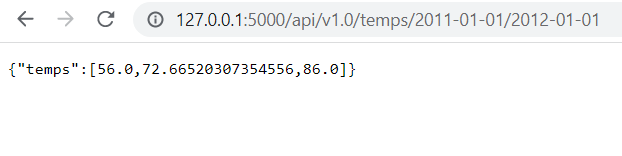

# sqlalchemy-challenge
## Module 10 Challenge
For this project I created a climate analysis for the area of Honolulu, Hawaii. First, I used Python and SQLAlchemy to do a basic climate analysis and data exploration of the Hawaii weather database. 

## Precipitation Analysis
For this analysis I retrieved the past 12 months of precipitation data and plotted the results using Pandas and Matplotlib.

## Station Analysis
In this part of the analysis I found the most-active station and designed a query that calculates the lowest, highest, and average temperatures of that station. Then, I retrieved the previous 12 months of observed temperature data at this station and plotted the results using a histogram. 

## Designing a Climate API
Now that the initial analysis has been completed, based on the queries I just developed, I created a Flask API. The routes are as follows;

- /api/v1.0/precipitation
    - Returns json with the date as the key and the value as the precipitation.
- /api/v1.0/stations
    - Returns jsonified data of all of the stations in the database.
- /api/v1.0/tobs
    - Returns jsonified data for the most active station for the past year.
- /api/v1.0/temp/start/
    - Returns the min, max, and average temperatures calculated from the given start date to the end of the dataset
- /api/v1.0/temps/start/end
    - Returns the min, max, and average temperatures calculated from the given start date to the given end date

Below is an images of the homepage of the API.

Here is an example of what a route would look like when using /api/v1.0/temps/start/end

